# Yuseff Farah
## Grupo 1A Fundamentos de Algebra

Los ejercicios deben estar bien resueltos y con los pasos explicados.

$1)$**Ubicar números reales en la recta numérica**
Ubicar en la recta numérica los siguientes números: √2, -3.5, 5.7, 0, -1/2
```
<------|-------|-------|-------|-------|------>
      -3.5    -1/2     0       √2     5.7
```
$2)$**Ubicar números reales en la recta numérica**
Ubicar en la recta numérica los siguientes números: π, -1.2, 5, 3/4, e 
```
<------|-------|-------|-------|-------|------>
      -1.2    3/4      e       π       5
```
$3)$**Ubicar números reales en la recta numérica**
Ubicar en la recta numérica los siguientes números: 3, e/2,-5, π, 1/4, -1.5, ln2
```
<------|-------|-------|-------|-------|------|------>
      -5      -1.5     1/4     ln2    e/2     3
```
$4)$**Ubicar números reales en la recta numérica**
Ubicar en la recta numérica los siguientes números: π/4, -6, 1.25, e, -3/4, 4, ln3
```
<------|-------|-------|-------|-------|------|------|------>
      -6      -3/4     π/4    ln3    1.25     e      4
```
$5)$**Ubicar números reales en la recta numérica**
Ubicar en la recta numérica los siguientes números: -0.2, 6, π/3,-2, 0.75, ln5, -5/4
```
<------|-------|-------|-------|-------|------|------|------>
      -2    -5/4       -0.2   0.75     π/3    ln5    6
```
$6)$**Ubicar números reales en la recta numérica**
Ubicar en la recta numérica los siguientes números:0.5, 8,π/2, -7, e/3, -2/3, -3.2
```
<------|-------|-------|-------|-------|------|------|------>
      -7      -3.2    -2/3    0.5      e/3    π/2    8
```
**Indica los conjuntos al que pertenece el número -1 y explica por qué**

7) $7 \in \mathbb{N}, \mathbb{Z}, \mathbb{Q}, \mathbb{R}$ porque se puede contar con los dedos.

8) $-10 \in \mathbb{Z}, \mathbb{Q}, \mathbb{R}$ porque al ser negativo no se puede contar con los dedos.

9) $7/3 \in \mathbb{Q}, \mathbb{R}$ porque es una fracción por lo que no se puede contar con los dedos.

10) $Φ \in \mathbb{I}, \mathbb{R}$ Por ser un número infinito no se puede contar.

11) $π/2 \in \mathbb{I}, \mathbb{R}$ Por tener pi sigue hasta el infinito.

12) $√9 \in \mathbb{N}, \mathbb{Z}, \mathbb{Q}, \mathbb{R}$ porque su resultado es 3, si se puede contar con los dedos.

**Usando PEMDAS, resuelve la siguiente expresión aritmética:**

13)
$$
\begin{array}{l c l}
6 - (3-1) & &  \\
4 & &   \\
\end{array}
$$

El resultado de $6 - (3-1) = 4$

14)
$$
\begin{array}{l c l}
18 \div (2+4) & & \\
3 & & \\
\end{array}
$$

El resultado de $18 \div (2+4) = 3$

15)
$$
\begin{array}{l c l}
\left(9 \times -3 + (1-2) \div -1 + 5\right) \times 3 & & \\
-63 & & \\
\end{array}
$$

El resultado de $\left(9 \times -3 + (1-2) \div -1 + 5\right) \times 3 = -63$

16)
$$
\begin{array}{l c l}
7 \times 3 - 1\left((-28 \times 2) \div 8 + 9\right) & & \\
42 & & \\
\end{array}
$$

El resultado de $7 \times 3 - 1\left((-28 \times 2) \div 8 + 9\right) = 42$

17)
$$
\begin{array}{l c l}
(22 + -6 \times 2 + 17 - 7) \div (2 \times 2) & & \\
5 & & \\
\end{array}
$$

El resultado de $(22 + -6 \times 2 + 17 - 7) \div (2 \times 2) = 5$

18)
$$
\begin{array}{l c l}
(4-1) \times -8 \div (5-(4+1)-1) & & \\
24 & & \\
\end{array}
$$

El resultado de $(4-1) \times -8 \div (5-(4+1)-1) = 24$

**Ubicar números complejos en el plano cartesiano**
Ubicar en el plano cartesiano (eje Real, eje Imaginario) los siguientes números complejos:

$19)$ $-2 + 3i$

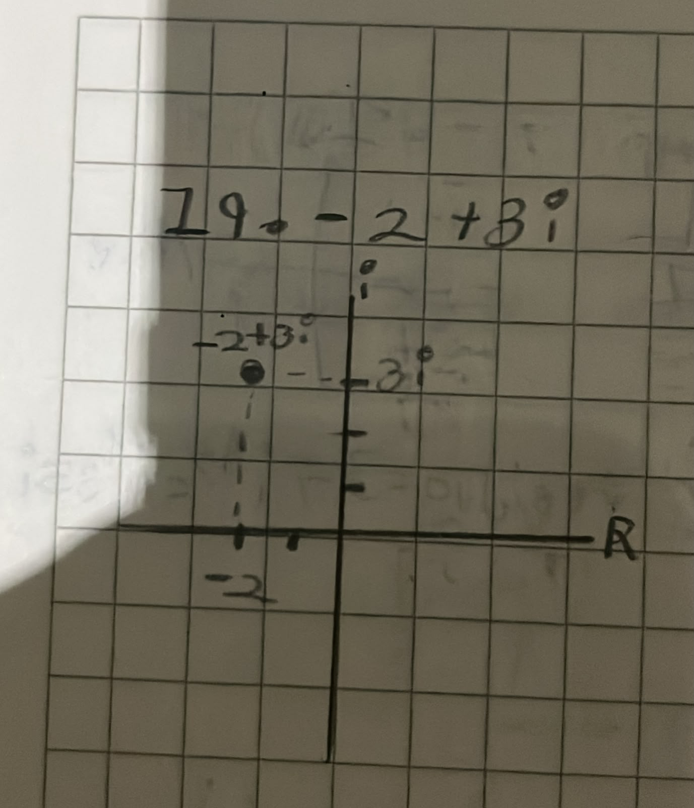

$20)$ $1 - 2i$

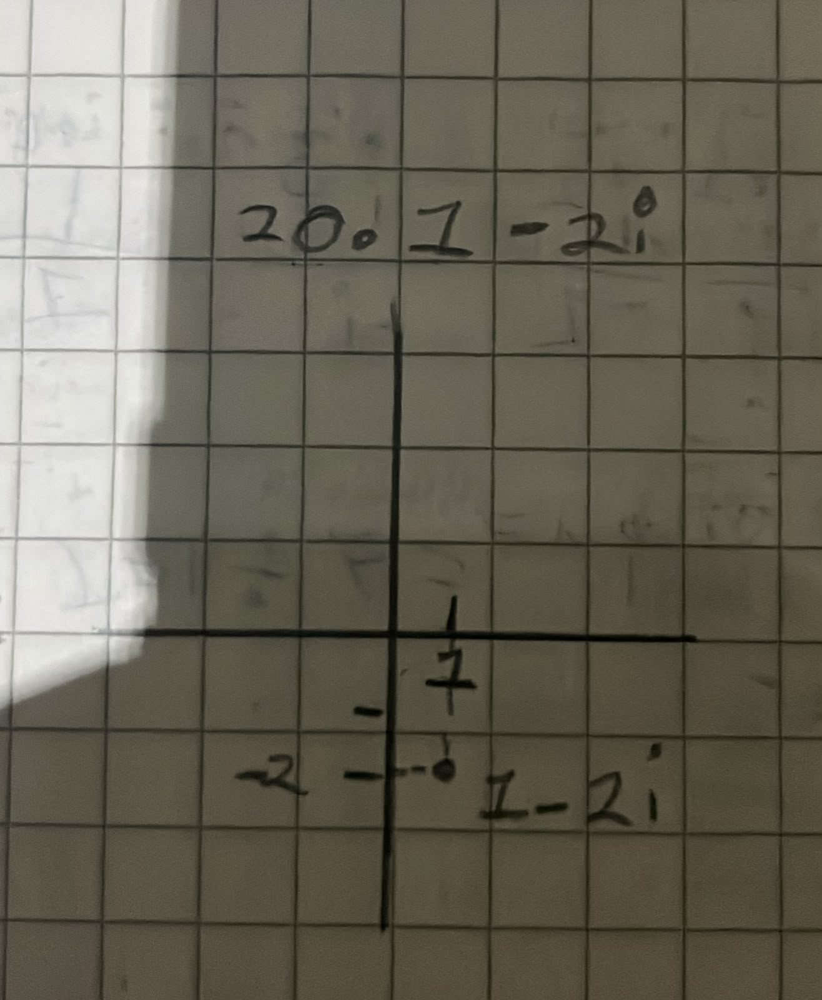

$21)$ $-4 + 3i$

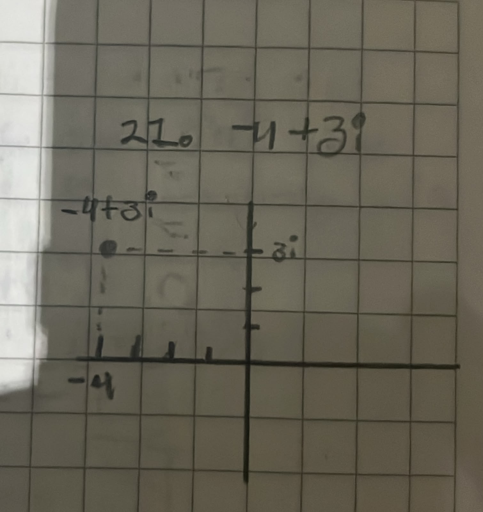

$22)$ $3 + i$

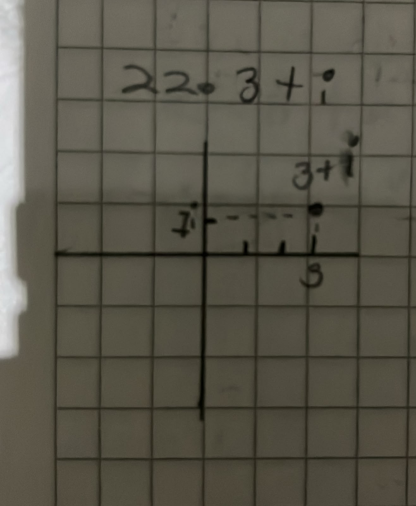

$23)$ $-4 - 4i$

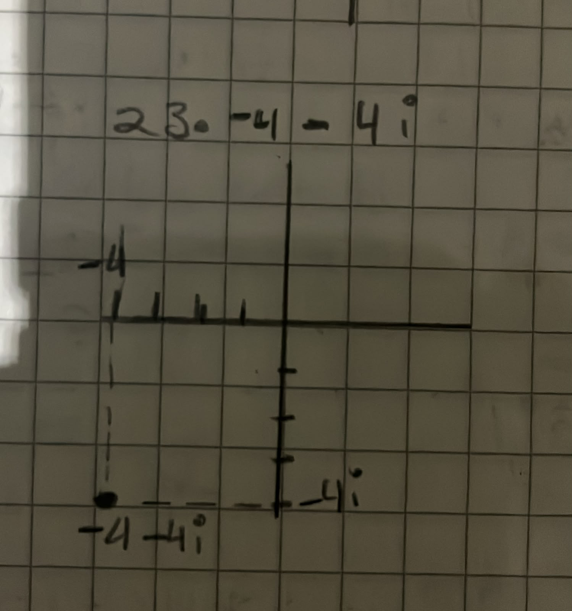

$24)$ $-2 - i$

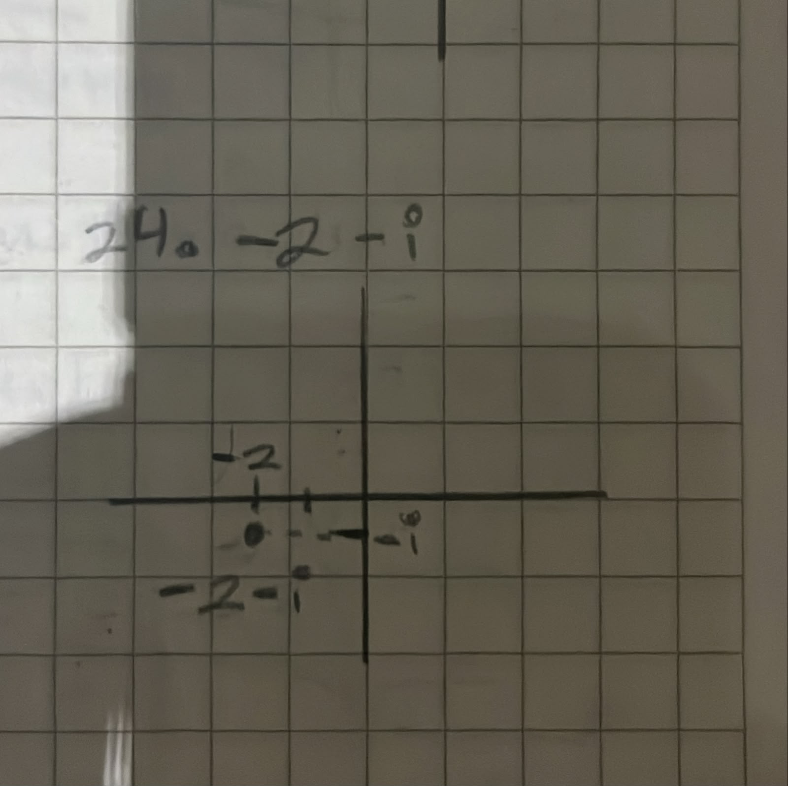
**Resuelve las siguientes operaciones con los números complejos**

$25)$ $(-7-4i)-(2+i)$

Resultado: $-9-5i$

$26)$ $(2-4i)-(5-3i)$

Resultado: $-3-i$

$27)$ $(7-8i)-(3i)-7$

Resultado: $-11i$

$28)$ $(1+5i)+(-8-5i)+3$

Resultado: $-4$

$29)$ $-8-(3-5i)+(4+8i)$

Resultado: $-7+13i$

$30)$ $(-4+2i)+(3i)+(-4-7i)$

Resultado: $-8-2i$

$31)$ $(2i)(-4i)$

Resultado: $8$

$32)$ $(-2i)(5i)*6$

Resultado: $60$

$33)$ $(-7i)(8+8i)(-2-8i)$

Resultado: $-560-336i$

$34)$ $(-2-4i)(-1-6i)(7-6i)$

Resultado: $-58+244i$

$35)$ $(3i)(1-7i)(7+4i)$

Resultado: $135+105i$

$36)$ $(-6i)(-5+i)(6-2i)$

Resultado: $96+168i$

$37)$ $\dfrac{10-7i}{1+3i}$

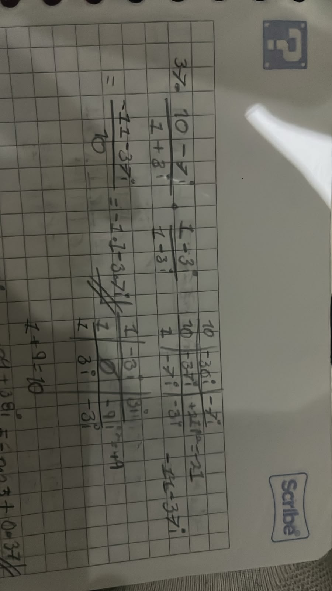
Resultado: $-1.1 - 3.7i$

$38)$ $\dfrac{4+2i}{-1-10i}$

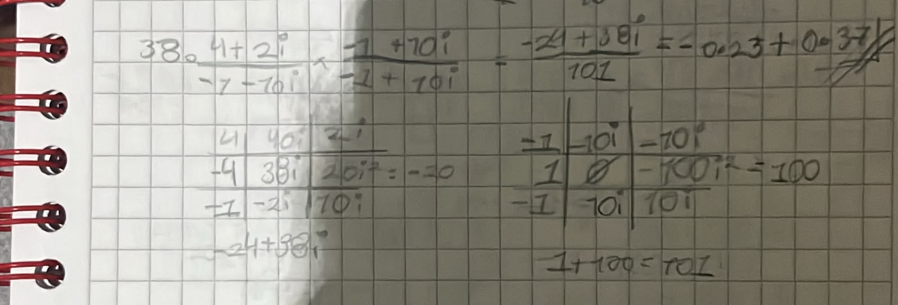
Resultado: $-0.23 + 0.37i$

$39)$ $\dfrac{1+4i}{-1-6i}$

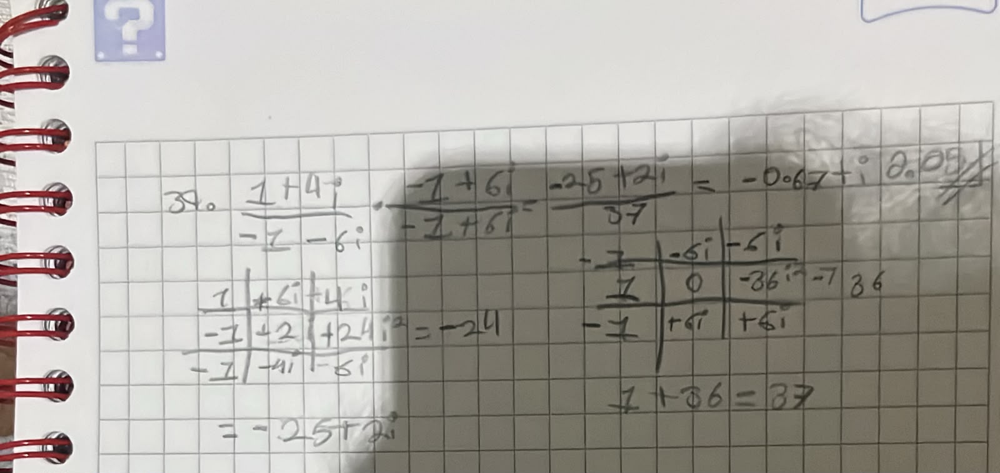
Resultado: $-0.67 + 0.05i$

$40)$ $\dfrac{-8+4i}{1+i}$

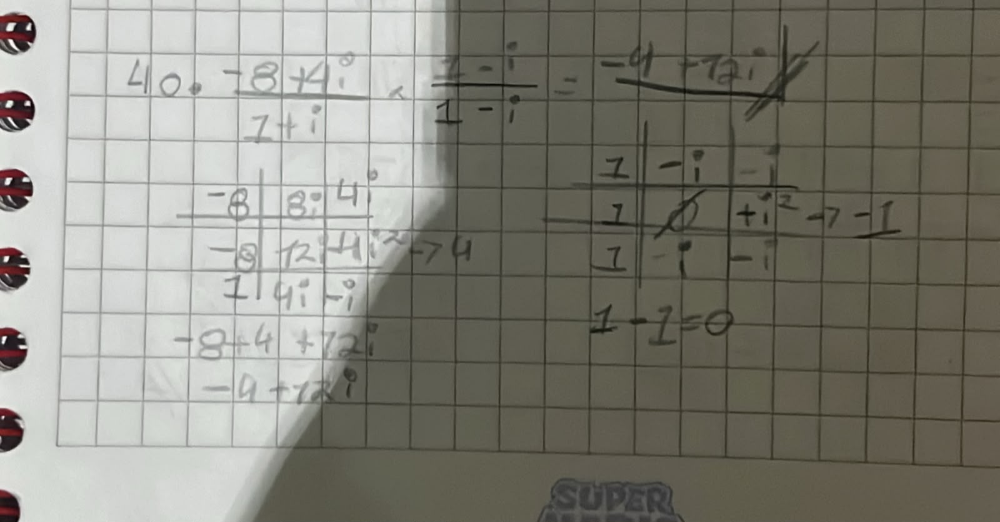
Resultado: $-4+12i$

$41)$ $\dfrac{-10+8i}{6+i}$

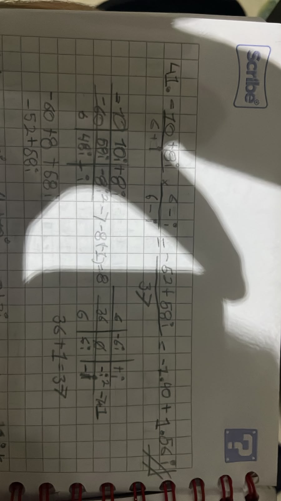
Resultado: $-1.40 + 1.56i$

$42)$ $\dfrac{2-2i}{4-10i}$

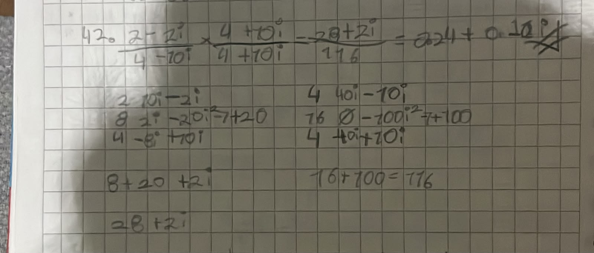
Resultado: $0.24 + 0.10i$

**Calcula el valor absoluto de los siguientes números complejos**

$43)$ $|-9-9i|$

Resultado: $12.72$

$44)$ $|8-6i|$

resultado: $10$

$45)$ $|6-3i|$

Resultado: $6.70$

$46)$ $|10+10i|$

Resultado: $14.14$

$47)$ $|6-10i|$

Resultado: $11.66$

$48)$ $|-1+7i|$

Resultado: $7.07$

**Resuelve las siguiente potencias de $i$**

$49)$ $i^{5}$

Resultado: $i$

$50)$ $i^{10}$

Resultado: $-1$

$51)$ $i^{20}$

Resultado: $1$

$52)$ $i^{35}$

Resultado: $-i$

$53)$ $i^{256}$

Resultado: $1$

$54)$ $i^{5^{5}}$

Resultado: $i$

**Convierte los siguientes números complejos a su forma polar**

$55)$ $6-8i$

Resultado: $10(\cos306+i\,\text{sen}306)$

$56)$ $5\sqrt{2}+5\sqrt{2}\cdot i$

Resultado: $10(\cos45+i\,\text{sen}45)$

$57)$ $2-2\sqrt{3}\cdot i$

Resultado: $4(\cos300+i\,\text{sen}300)$

$58)$ $\dfrac{3\sqrt{3}}{2}-\dfrac{3i}{2}$

Resultado: $3(\cos330+i\,\text{sen}330)$

$59)$ $-2$

Resultado: $2(\cos180+i\,\text{sen}180)$

$60)$ $-7i$

Resultado: $7(\cos270+i\,\text{sen}270)$

**Convierte los números complejos de su forma polar a su forma rectangular**

$61)$ $\cos30+i\,\text{sen}30$

Resultado: $0.86+0.5i$

$62)$ $2(\cos60+i\,\text{sen}60)$

Resultado: $1+1.73i$

$63)$ $1.5(\cos90+i\,\text{sen}90)$

Resultado: $1.5i$

$64)$ $2.5(\cos120+i\,\text{sen}120)$

Resultado: $-1.25+2.16i$

$65)$ $4(\cos135+i\,\text{sen}135)$

Resultado: $-2.82+2.82i$

$66)$ $3(\cos180+i\,\text{sen}180)$

Resultado: $-3$

**Obtén TODAS las raíces de los siguientes complejos**

$67)$ 2 raíces cuadradas de $4(\cos30+i\,\text{sen}30)$

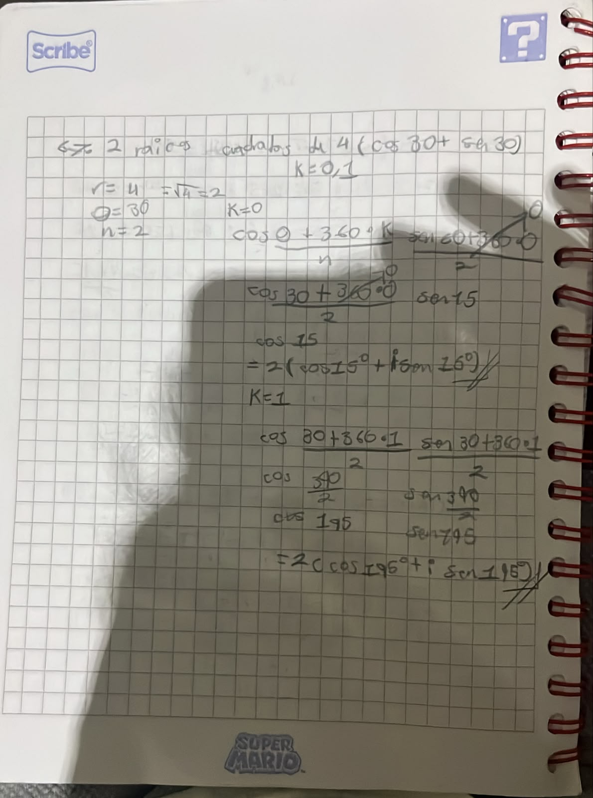
$2(\cos15+i\,\text{sen}15)$
$2(\cos195+i\,\text{sen}195)$

$68)$ 2 raíces cuadradas de $3(\cos90+i\,\text{sen}90)$

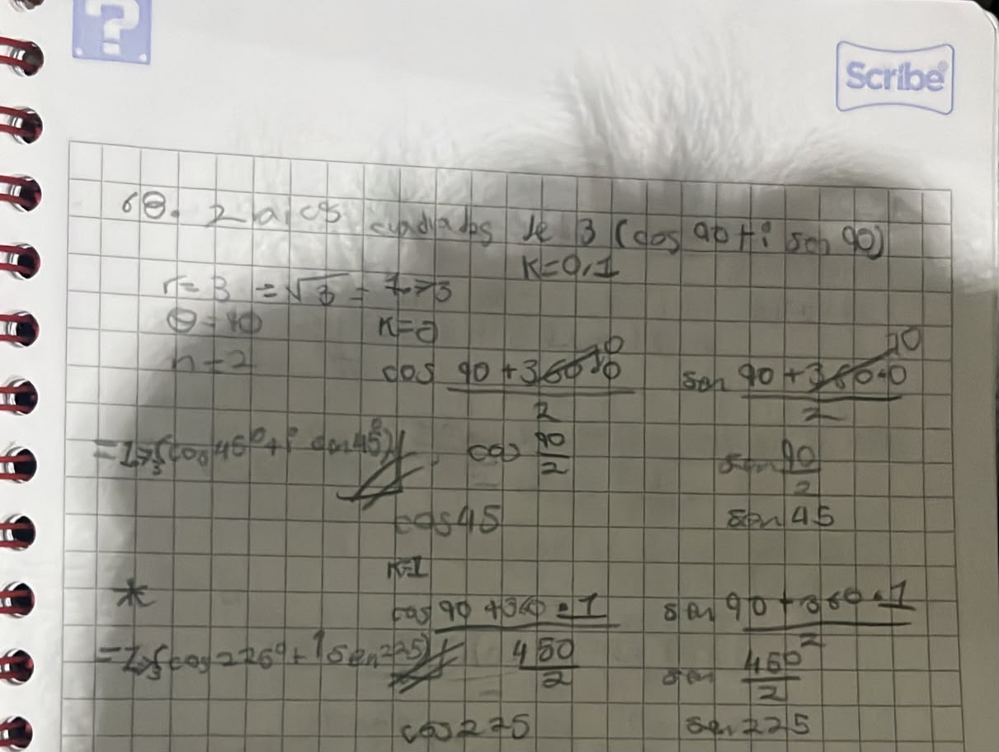
$1.73(\cos45+i\,\text{sen}45)$
$1.73(\cos225+i\,\text{sen}225)$

$69)$ 3 raíces cúbicas de $-4\sqrt{2}+4i\sqrt{2}$

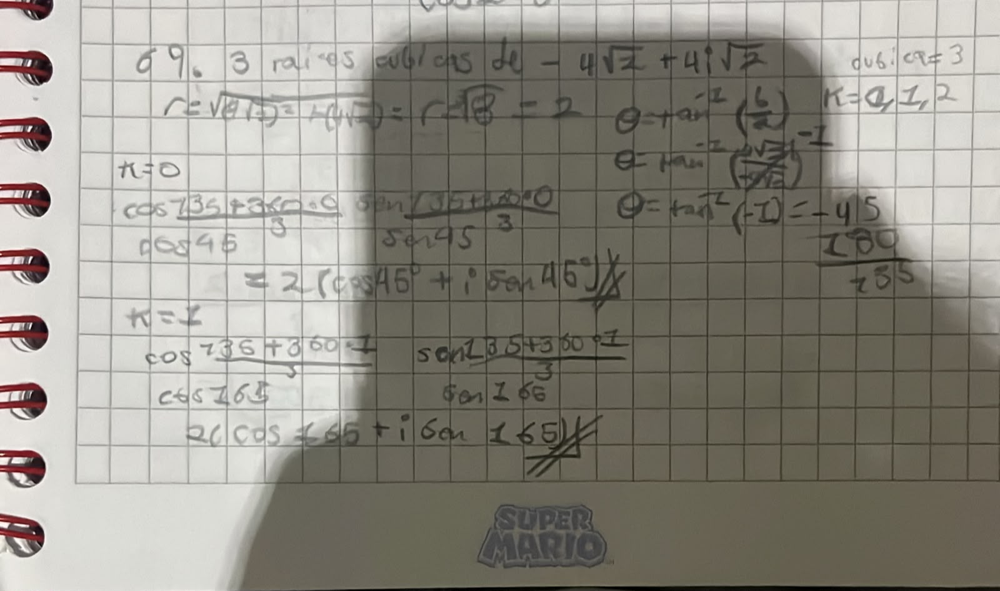
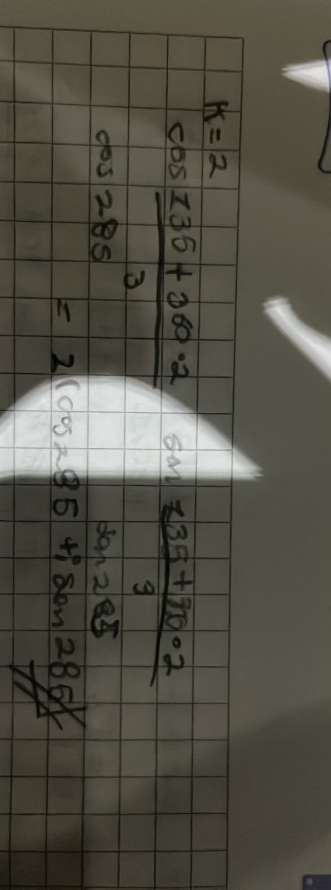
$2(\cos45+i\,\text{sen}45)$
$2(\cos165+i\,\text{sen}165)$
$2(\cos285+i\,\text{sen}285)$

$70)$ 3 raíces cúbicas de $-\dfrac{27}{8}$

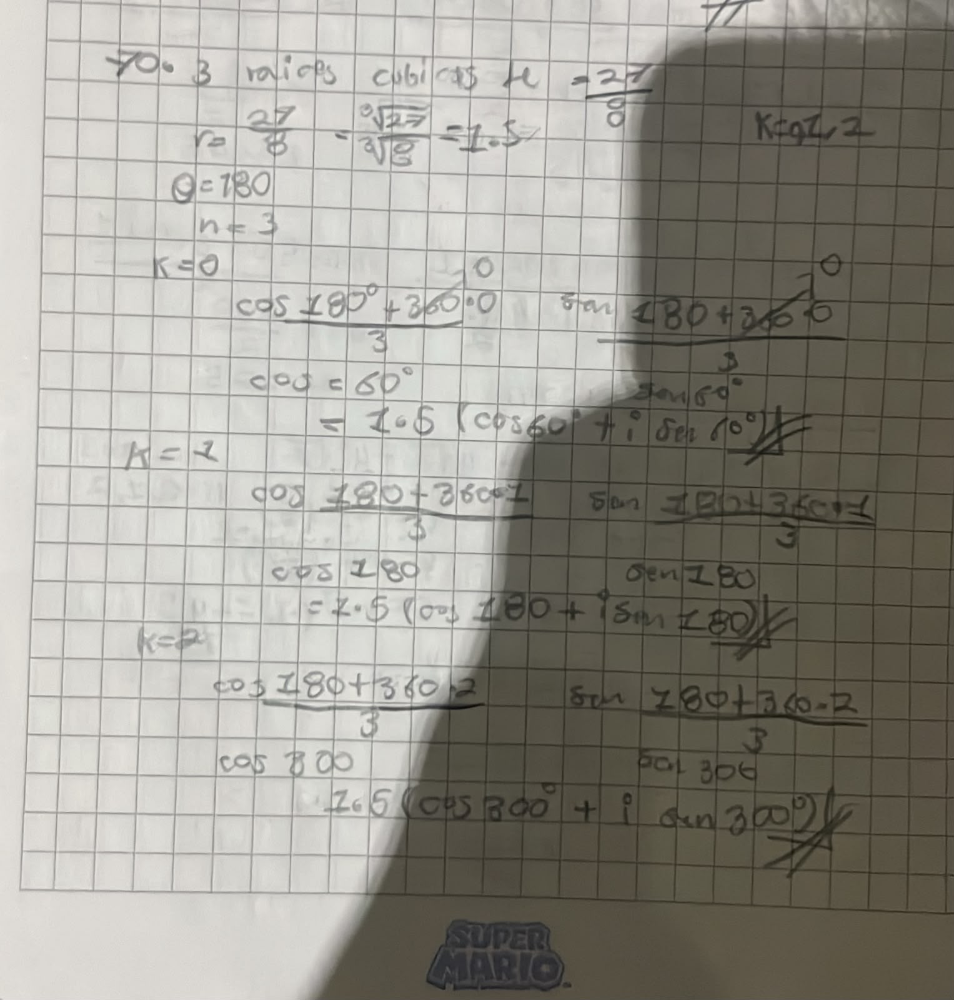
$1.5(\cos60°+i\,\text{sen}60°)$
$1.5(\cos180+i\,\text{sen}180)$
$1.5(\cos300+i\,\text{sen}300)$

$71)$ 5 raíces de $-32i$

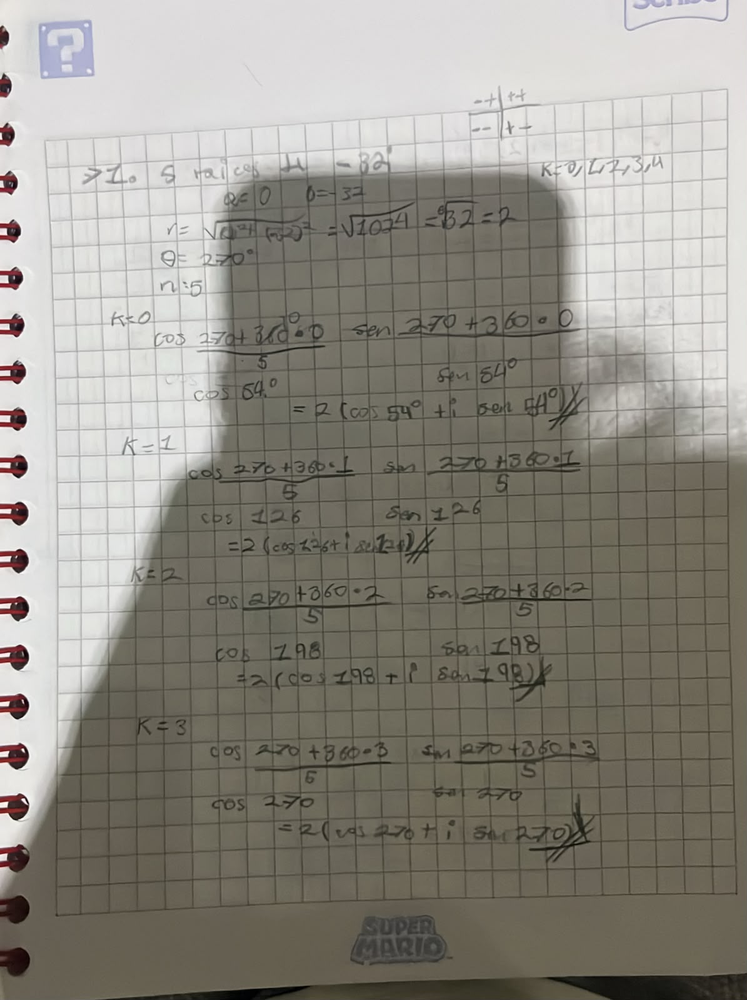
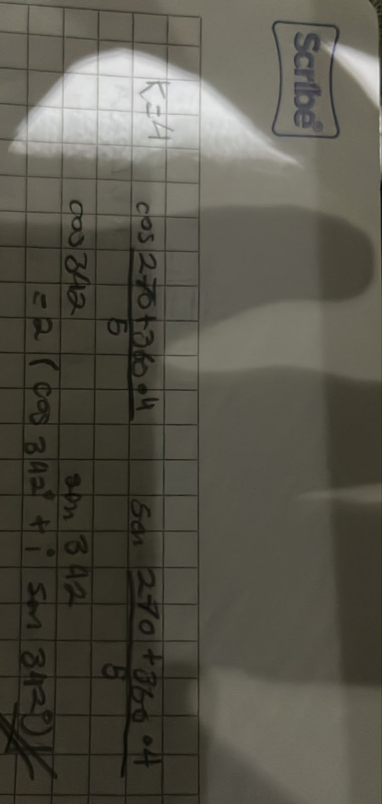
$2(\cos54+i\,\text{sen}54)$
$2(\cos126+i\,\text{sen}126)$
$2(\cos198+i\,\text{sen}198)$
$2(\cos270+i\,\text{sen}270)$
$2(\cos342+i\,\text{sen}342)$

$72)$ 6 raíces de $729$

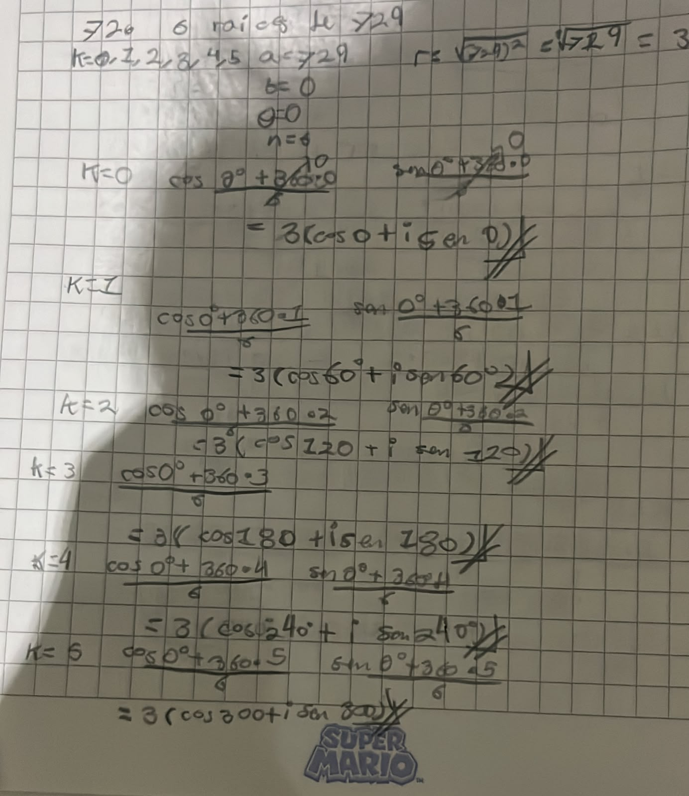
$3(\cos0+i\,\text{sen}0)$
$3(\cos60+i\,\text{sen}60)$
$3(\cos120+i\,\text{sen}120)$
$3(\cos180+i\,\text{sen}180)$
$3(\cos240+i\,\text{sen}240)$
$3(\cos300+i\,\text{sen}300)$

**Realiza las conversiones de binario a decimal**

$73)$ $00001111$

Resultado: $15$

$74)$ $10011001$

Resultado: $153$

$75)$ $11001100$

Resultado: $204$

$76)$ $01111011$

Resultado: $123$

$77)$ $00000000 11111111$

Resultado: $255$

$78)$ $00000010 00000000$

Resultado: $512$

**Convierte de binario a octal**

$79)$ $11010101$

Resultado: $325$

$80)$ $01101110$

Resultado: $156$

$81)$ $10110011$

Resultado: $263$

$82)$ $00000000 11111111$

Resultado: $377$

$83)$ $00000011 11000000$

Resultado: $1700$

$84)$ $00000101 01010101$

Resultado: $2525$

**Convierte de binario a hexadecimal**

$85)$ $11011010$

Resultado: $DA$

$86)$ $01111100$

Resultado: $7C$

$87)$ $10110101$

Resultado: $B5$

$88)$ $11110000 10100101$

Resultado: $F0A5$

$89)$ $00001111 00001111$

Resultado: $0F0F$

$90)$ $10000000 00000001$

Resultado: $8001$

**Convierte de octal a binario**

$91)$ $325$

Resultado: $11010101$

$92)$ $156$

Resultado: $01101110$

$93)$ $377$

Resultado: $11111111$

$94)$ $01777$

Resultado: $00000011 11111111$

$95)$ $03700$

Resultado: $00000111 11000000$

$96)$ $05255$

Resultado: $00001010 10101101$

**Convierte de hexadecimal a binario**

$97)$ $DA$

Resultado: $11011010$

$98)$ $7C$

Resultado: $01111100$

$99)$ $B5$

Resultado: $10110101$

$100)$ $F0A5$

Resultado: $11110000 10100101$

$101)$ $0F0F$

Resultado: $00001111 00001111$

$102)$ $8001$

Resultado: $10000000 00000001$

**Nombra los polinomios por su exponente más alto y número de términos**

$103)$ $5n+5$

Resultado: Binomio de primer grado

$104)$ $-10p^3-6+9p^2-4p^5-2p^8$

Resultado: Polinomio de octavo grado 

$105)$ $7x^8$

Resultado: Monomio de octavo grado

$106)$ $-2n+n^4+10n^6$

Resultado: Trinomio de sexto grado

$107)$ $5$

Resultado: Monomio

$108)$ $5v^7$
Resultado: Monomio de septimo grado

**Resuelve las siguientes preguntas**

$109)$ Amy puede verter una gran entrada de concreto en ocho horas. Un día su amiga Jill la ayudó y solo tomó 3.08 horas. Encuentra cuánto le tomaría a Jill hacerlo sola.

Resultado: A Jill le tomaría 5 horas.

$110)$ Jaidee puede cavar un hoyo de 10 pies por 10 pies en cinco horas. Ted puede cavar el mismo hoyo en siete horas. Si trabajaran juntos, ¿cuánto tiempo les tomaría?

Resultado: Les tomaría 2.92 horas a ambos.

$111)$ Un avión de carga salió de Los Ángeles y voló hacia Moscú. Un avión de la Fuerza Aérea salió cuatro horas después volando a 310 km/h en un esfuerzo por alcanzar al avión de carga. Después de volar durante seis horas, el avión de la Fuerza Aérea finalmente lo alcanzó. ¿Cuál era la velocidad promedio del avión de carga?

Resultado: La velocidad promedio fue de  186 km/h

$112)$ Un tren de carga viajó a Nueva York y de regreso. En el viaje de ida viajó a 35 km/h y en el viaje de regreso fue a 49 km/h. ¿Cuánto tiempo tomó el viaje de ida si el viaje de regreso tomó diez horas?

Resultado: Fue de 14 horas la ida a 35 km/h

$113)$ 1 yd³ de tierra que contenía 30% de arena se mezcló con 4 yd³ de tierra que contenía 20% de arena. ¿Cuál es el contenido de arena de la mezcla?

Resultado: El contenido de arena es del 22%

$114)$ Para su fiesta de cumpleaños, James mezcló 7 L de ponche de frutas de la Marca A y 6 L de la Marca B. La Marca A contiene 11% de jugo de fruta y la Marca B contiene 24% de jugo de fruta. ¿Qué porcentaje de la mezcla es jugo de fruta?

Resultado: La mezcla del juego es de 22%

**Simplifica las siguientes expresiones**

$115)$ $(5-11v)-(-3v^2+9-13v)$

Resultado: $3v^2+2v-4$

$116)$ $(-14n^4+3n^5)+(-12n^4+4n+2n^5)$

Resultado: $5n^5-26n^4+4n$

$117)$ $(4b^2+7b^4+12b-7)+(11+7b+4b^2)+(10b^4+b)$

Resultado: $17b^4+8b^2+20b+4$

$118)$ $(3-2x-9x^4-8x^5)-(1+9x^5+6x)+(13x^2+8x^5)$

Resultado: $-9x^5-9x^4+13x^2-8x+2$

$119)$ $(11b^4+5b^2+8+9b^3)+(6b^4-8b^2-7)+(-13b^3+11b^4)$

Resultado: $28b^4-4b^3-3b^2+1$

$120)$ $(-11n^2+9n^5+11n^4+12n)-(-9n^5+7-8n^4)+(-2n^2-14n^5)$

Resultado: $4n^5+19n^4-13n^2+12n-7$

**Realiza los siguientes productos**

$121)$ $-3b(-b^2-5b-2)$

Resultado: $3b^3+15b^2+6b$

$122)$ $3n(-3n^2-n+4)$

Resultado: $-9n^3-3n^2+12n$

$123)$ $8(-7m^2-5m-8)$

Resultado: $-56m^2-40m-64$

$124)$ $-8(6x^2+4x+5)$

Resultado: $-48x^2-32x-40$

$125)$ $2(2x^2-6x-4)$

Resultado: $4x^2-12x-8$

$126)$ $-7r^2(-3r^2+3r-8)$

Resultado: $21r^4-21r^3+56r^2$

$127)$ $(8n-6)(3n^2-6n+8)$

Resultado: $24n^3-66n^2+100n-48$

$128)$ $(6n+3)(5n^2-3n-5)$

Resultado: $30n^3-3n^2-39n-15$

$129)$ $(8b+3)(5b^2+2b-5)$

Resultado: $40b^3+31b^2-34b-15$

$130)$ $(8x-7)(2x^2-x-6)$

Resultado: $16x^3-22x^2-41x+42$

$131)$ $(5x-7)(2x^2+3x+3)$

Resultado: $10x^3+x^2-6x-21$

$132)$ $(5x-2)(8x^2+7x-2)$

Resultado: $40x^3+19x^2-24x+4$

**Simplifica las siguientes expresiones**

$133)$ $\dfrac{a^2 \cdot (3a^2)^2}{2a^0}$

Resultado: $\dfrac{9a^6}{2}$

$134)$ $\left(\dfrac{3r^3 \cdot 2r^3}{2rr^2}\right)^2$

Resultado: $9r^6$

$135)$ $\dfrac{v^0 \cdot (3v^3)^2}{(v^0)^3}$

Resultado: $9v^6$

$136)$ $\left(\dfrac{2v^3}{2v^2 \cdot 3v}\right)^3$

Resultado: $\dfrac{1}{27}$

$137)$ $\left(\dfrac{(3x)^3}{3x \cdot 3x}\right)^2$

Resultado: $9x^2$

$138)$ $\dfrac{x^2 \cdot (2x^2)^2}{3x}$

Resultado: $\dfrac{4x^5}{3}$

**Simplifica los siguientes radicales**

$139)$ $\sqrt{18x^3}$

Resultado: $3x\sqrt{2x}$

$140)$ $\sqrt[4]{80n^6}$

Resultado: $2n\sqrt[4]{5n^2}$

$141)$ $\sqrt{192n^3}$

Resultado: $8n\sqrt{3n}$

$142)$ $\sqrt{288n}$

Resultado: $12\sqrt{2n}$

$143)$ $\sqrt{18v^2}$

Resultado: $3v\sqrt{2}$

$144)$ $\sqrt[4]{32n^4}$

Resultado: $2n\sqrt[4]{2}$

**Simplifica las siguientes expresiones**

$145)$ $\dfrac{2}{5+3\sqrt{3}}$

Resultado: $5+3\sqrt{3}$

$146)$ $\dfrac{4}{5\sqrt{3}-4}$

Resultado: $\dfrac{20\sqrt{3}+16}{59}$

$147)$ $\dfrac{2}{3\sqrt{2}+5\sqrt{3}}$

Resultado: $\dfrac{6\sqrt{2}+10\sqrt{3}}{57}$

$148)$ $\dfrac{4}{\sqrt{3}-2}$

Resultado: $-4\sqrt{3}-8$

$149)$ $\dfrac{3}{-4+4\sqrt{2}}$

Resultado: $\dfrac{3+3\sqrt{2}}{4}$

$150)$ $\dfrac{2}{4+\sqrt{2}}$

Resultado: $\dfrac{4-\sqrt{2}}{7}$
